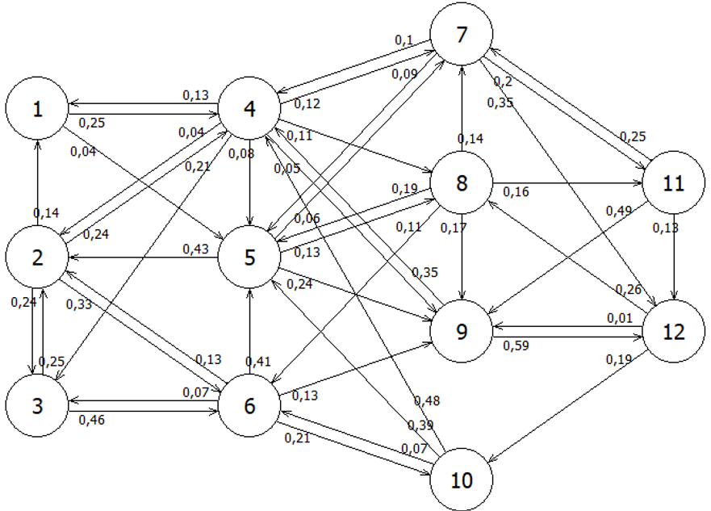
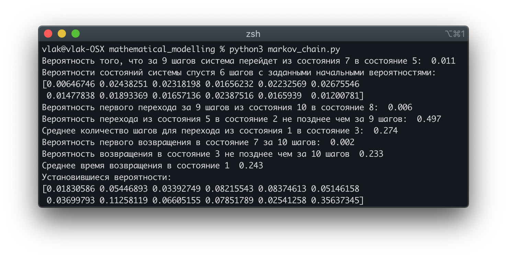
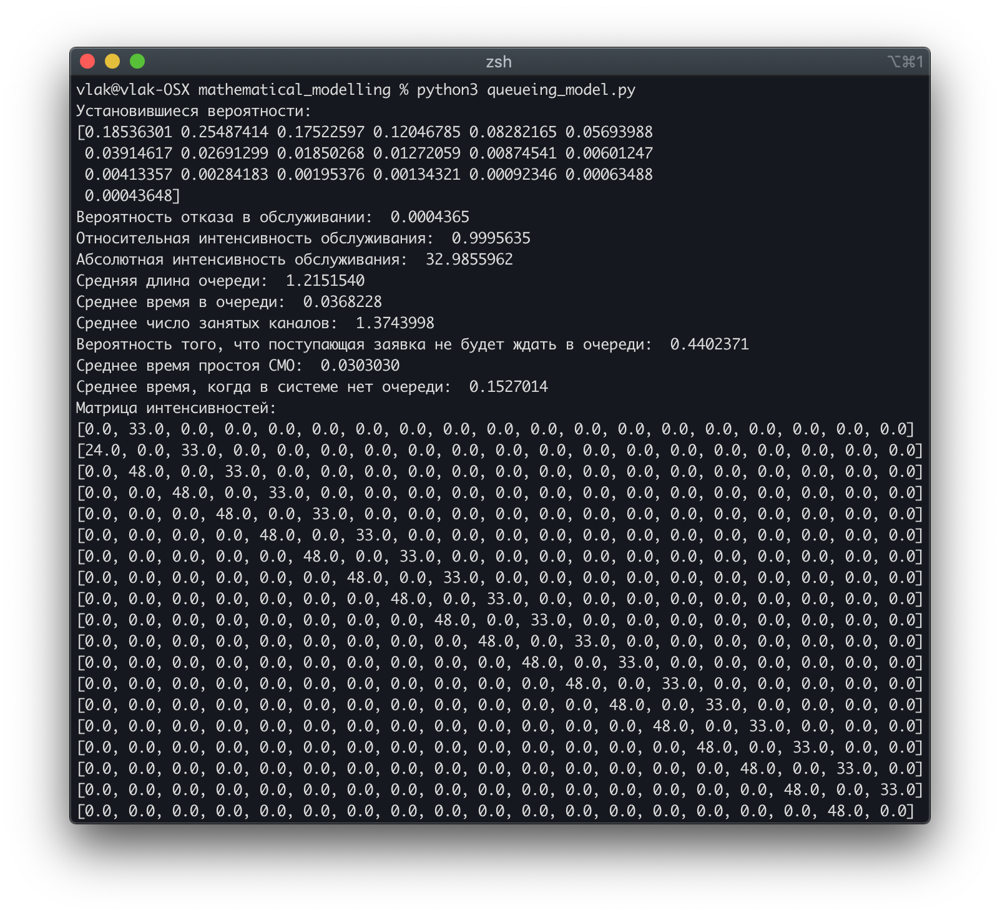

# Контрольная работа по математическому моделированию
### Владимир Кирилкин ПИ18-2, вариант 31
## Задание 1
Система имеем 12 дискретных состояний. Изменение состояний происходит в дискретные моменты времени с заданной вероятность. Схема марковского процесса изображена на рисунке.

Требуется определить:
1) Вероятность того, что за 9 шагов система перейдет из состояния 7 в состояние 5
2) Вероятности состояний системы спустя 6 шагов, если в начальный момент вероятность состояний были следующими `A = (0,01; 0,11; 0,09; 0; 0,06; 0,12; 0,08; 0,12; 0,12; 0,07; 0,14; 0,08)`
3) Вероятность первого перехода за 9 шагов из состояния 10 в состояние 8
4) Вероятность перехода из состояния 5 в состояние 2 не позднее чем за 9 шагов
5) Среднее количество шагов для перехода из состояния 1 в состояние 3
6) Вероятность первого возвращения в состояние 7 за 10 шагов
7) Вероятность возвращения в состояние 3 не позднее чем за 10 шагов
8) Среднее время возвращения в состояние 1
9) Установившиеся вероятности
#### Ответы

## Задание 2
Задана система массового обслуживания со следующими характеристиками:
- интенсивность поступления			`λ=33`
- каналов обслуживания				`m=2`
- интенсивность обслуживания		`μ=24`
- максимальный размер очереди		`n=16`

Изначально требований в системе нет
1)	Составьте граф марковского процесса, запишите систему уравнений Колмогорова и найдите установившиеся вероятности состояний.
2)	Найдите вероятность отказа в обслуживании.
3)	Найдите относительную и абсолютную интенсивность обслуживания.
4)	Найдите среднюю длину в очереди.
5)	Найдите среднее время в очереди.
6)	Найдите среднее число занятых каналов.
7)	Найдите вероятность того, что поступающая заявка не будет ждать в очереди.
8)	Найти среднее время простоя системы массового обслуживания.
9)	Найти среднее время, когда в системе нет очереди.
#### Ответы
